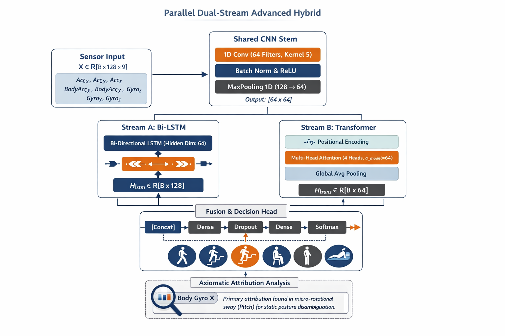

# 🧠 Human Activity Recognition (HAR)
### 🚀 Parallel Dual-Stream Hybrid System for Time-Series Intelligence

<p align="center">
  
  
  
  
</p>

---

## 📌 Overview

This repository implements a **State-of-the-Art (SOTA) Human Activity Recognition (HAR) system** using high-frequency (**50Hz**) multivariate sensor data.

The core contribution is a **Parallel Dual-Stream Hybrid Architecture** that fuses:

- 🔁 **Bidirectional Temporal Dynamics** (Bi-LSTM)  
- 🌐 **Global Context Modeling** (Transformer)  

This design enables the model to **simultaneously capture motion dynamics and posture context**, achieving:

- 🚀 **91.62% Accuracy**
- ⚡ **Optimized inference** on Apple Silicon (MPS / M4 Pro)
- 🧠 **Physically interpretable predictions** via XAI

> 💡 **This is not just a model — it is a research-to-production ML system.**

---

## 🧠 Architecture: Parallel Advanced Hybrid

Instead of naive sequential stacking, the system employs:

> ⚙️ **Shared CNN Stem + Parallel Dual Streams**

This design explicitly addresses:

> ⚖️ **Temporal–Spatial Representation Trade-off**

<p align="center">
  
</p>

---

## ⚙️ Technical Breakdown

### 🔹 Shared CNN Stem (Feature Compression)

The initial CNN layer extracts and compresses features:

- **1D-CNN** extracts local motion signatures
- **MaxPool1d** reduces temporal resolution (128 → 64)
- Serves three critical functions:
  - Noise filtering  
  - Feature compression  
  - Computational optimization  

### 🔹 Stream A: Temporal Dynamics (Bi-LSTM)

Captures sequential patterns in sensor data:

- Bidirectional encoding for complete temporal context:
  - Forward pass: h_forward  
  - Backward pass: h_backward  
- Learns activity-specific patterns:
  - Walking trajectories and motion flow
  - Directional transitions and momentum  

### 🔹 Stream B: Global Context Modeling (Transformer)

Processes global sensor relationships:

- Multi-head self-attention (4 heads)
- Analyzes entire temporal window (~2.56s)
- Solves sequential bottlenecks and memory decay issues
- Learns:
  - Posture distribution across time
  - Cross-sensor relationships  
  - Static activity cues  

### 🔹 Fusion & Decision Head

Combines both streams intelligently:

- Feature concatenation: 128 (Bi-LSTM) + 64 (Transformer) → 192-dimensional vector
- Fully connected MLP layer with dropout regularization
- Final softmax classifier for activity prediction

> 💡 **Final decision balances dynamic motion flow with static posture awareness**

---

## 📊 Benchmarking & Results

All models trained for **200–300 epochs** on a 9-axis multivariate sensor dataset.

| Architecture        | Accuracy | Macro F1 | Key Insight |
|--------------------|----------|----------|-------------|
| 1D-CNN             | 90.91%   | 0.9100   | Strong local feature extraction |
| LSTM               | 90.74%   | 0.9078   | Effective sequence modeling |
| CNN-LSTM           | 90.97%   | 0.9114   | Stable hybrid baseline |
| Transformer        | 88.94%   | 0.8883   | Global modeling limitations |
| 🚀 **Advanced Hybrid** | **91.62%** | **0.9167** | **Best overall performance** |

---

## 🔬 Axiomatic Interpretability (XAI)

Using **Integrated Gradients (Captum)** for model transparency:

### 🧩 Case Study: Sitting vs. Standing

**Problem Identified:**
- Accelerometer signals are nearly identical between activities

**Model's Solution:**
- Ignores noisy accelerometer data  
- Focuses on **Body Gyro X component (~90% attribution)**  

### 🧠 Physical Interpretation

The model implicitly learns biomechanical physics:

> 🔁 **Micro-rotational sway (pitch angle)**  
> ↓  
> **Human inverted pendulum effect**  

This corresponds to how humans naturally maintain balance through subtle rotational adjustments.

### 🎯 Key Takeaway

- Model learns **biomechanical physics**, not just statistical patterns
- Decisions are grounded in physical reality

---

## 🚀 Usage

### Installation

```bash
git clone https://github.com/Debajyoti-Das-1/Human-Activity-Recognition.git
cd Human-Activity-Recognition
pip install -r requirements.txt
```

### Training & Evaluation

```bash
# Train the advanced hybrid model
python train.py --model advanced_hybrid --epochs 200 --lr 1e-4

# Evaluate trained model
python evaluate.py --model advanced_hybrid
```

### Real-Time Inference

```bash
python inference.py --model advanced_hybrid
```

---

## 📂 Project Structure

```
.
├── configs/                    # Configuration files
├── data/
│   ├── raw/                   # Original sensor data
│   └── processed/             # Preprocessed datasets
├── experiments/
│   ├── checkpoints/           # Saved model weights
│   └── logs/                  # Training logs and metrics
├── src/
│   ├── data/                  # Data loading and preprocessing
│   ├── models/                # Architecture definitions
│   ├── training/              # Training loops and utilities
│   └── evaluation/            # Evaluation metrics and analysis
├── train.py                   # Main training script
├── evaluate.py                # Evaluation script
├── inference.py               # Inference script
└── requirements.txt           # Python dependencies
```

---

## 🌟 Why This Project Stands Out

✅ **Parallel architecture design** — non-trivial multi-stream fusion  
✅ **Interdisciplinary approach** — Deep Learning + Signal Processing + Biomechanics  
✅ **Built-in explainability** — XAI for model transparency  
✅ **Hardware optimized** — Apple Silicon (MPS) for efficient inference  
✅ **Production-ready** — Real-time inference capabilities  

---

## 🔮 Future Work

### 📈 Modeling Enhancements
- Time-series augmentation (DTW, noise injection)
- Self-supervised pretraining strategies
- Contrastive learning frameworks

### 📱 Deployment & Optimization
- ONNX / TorchScript export for cross-platform compatibility
- Edge deployment on mobile devices
- Quantization for reduced model size

### 🧠 Research Directions
- Modern architectures (Informer, TimesNet)
- Multi-modal fusion (IMU + Vision)
- Transfer learning for domain adaptation

---

## 🤝 Contributing

Contributions are welcome! We encourage:

- Adding new architectures or improvements
- Enhancing training pipeline efficiency
- Expanding interpretability analysis
- Improving documentation

Please submit a pull request with a clear description of changes.

---

## 📜 License

This project is licensed under the **MIT License** — see the LICENSE file for details.

---

## ⭐ Support

If you found this project valuable:

- ⭐ **Star** the repository
- 🍴 **Fork** and contribute improvements
- 🐛 **Report issues** for bug fixes
- 💬 **Discuss** ideas and suggestions

---

## 👨‍💻 Author

**Debajyoti Das**  
AI/ML Engineer | Time-Series Analysis | Deep Learning Systems

---

## 📖 Citation

If you use this work in your research, please cite:

```bibtex
@software{das2024har,
  author = {Das, Debajyoti},
  title = {Parallel Dual-Stream Hybrid System for Human Activity Recognition},
  year = {2024},
  url = {https://github.com/Debajyoti-Das-1/Human-Activity-Recognition}
}
```